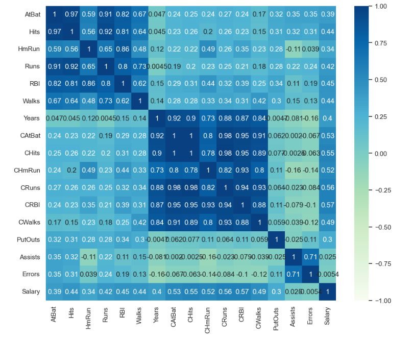

# Linear, Ridge, and Lasso Regression on Hitters Dataset

An end-to-end Machine Learning project to predict baseball players' salaries using different regularized linear regression techniques. 

## Dataset Overview
The dataset contains 322 observations on major league baseball players. It includes 20 variables, such as performance metrics (Hits, HomeRuns, Runs) and career statistics, with **Salary** as the target variable.

##  Project Steps & Methodology
1. **Data Cleaning:** Handled missing values (specifically in the Salary column) and performed one-hot encoding for categorical variables.
2. **Exploratory Data Analysis (EDA):** Analyzed correlations between features and the target variable.
3. **Model Training:** Implemented and optimized three regression models:
   * Multiple Linear Regression
   * Ridge Regression (L2 Regularization)
   * Lasso Regression (L1 Regularization)
4. **Hyperparameter Tuning:** Used Cross-Validation to find the optimal alpha/lambda values for Ridge and Lasso.

## Results & Visualizations
Below is the performance comparison and residual analysis of the models:

##  Tech Stack
* Python
* Pandas & NumPy
* Scikit-Learn
* Matplotlib & Seaborn
